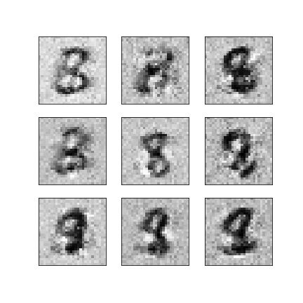

# GAN_MNIST

Generative Adverserial Network implementation with Pytorch

### How to run

``` python
import GAN_MNIST

try:
    # train
    GAN_MNIST.train.run()
except KeyboardInterrupt:
    try:
        # if in colab, download checkpoint in colab
        from google.colab import files
        files.download('checkpoint_generator.pt')
        files.download('checkpoint_discriminator.pt')
    except ImportError:
        pass

# print image on trained neuralnet
GAN_MNIST.showimg.printImg()

```

### Example

Example data is in `example/` directory
TODO: More epoch + improve model


